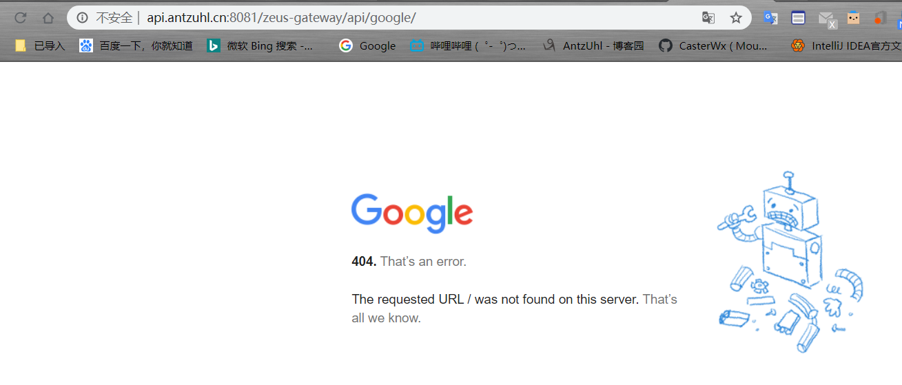
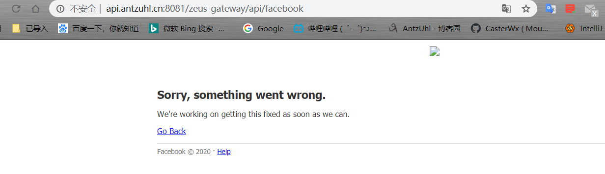

# Back-end-Broker

前段时间做了一个[API网关](https://github.com/CasterWx/Zeus)，基于其对请求的路由，获取响应返回给请求端的实现，其实很容易改造成一个后端代理。

通过简单的转发就可以完成基本的代理工作了。

但是请求参数需要重新包装一下，否则如上图，虽然访问到了google和Facebook的服务器，但对方返回了400，无效请求，所以需要对请求再包装一下。

另外，因为是对请求的转发，返回响应给请求端之后，对方可能会请求img，js等资源，会绕过我们的网关，所以需要对页面内请求的资源再做处理。

参考: [https://github.com/EtherDream/jsproxy/blob/master/docs/blogs/js-hook.md](https://github.com/EtherDream/jsproxy/blob/master/docs/blogs/js-hook.md)
